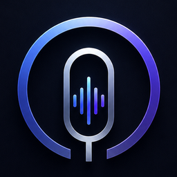

<div align="center">
  
  <h1>DikteX</h1>
  <p><b>Windows 11 için sesle çalışan yapay zeka asistanı.</b><br>
  Kısayola bas, konuş, bırak — temizlenmiş ve bağlama uygun metin imlecinin olduğu yere yapışsın.</p>
</div>

---

## Ne yapar

DikteX bir dikte aracı değil, sesle çalışan bir **prompt motorudur**. Konuştuğunuz
dağınık cümleyi alır; dolgu kelimeleri ayıklar, hangi uygulamada olduğunuzu anlar
ve çıktıyı o ortama uygun biçimde üretir — VS Code'da kod, Slack'te profesyonel
mesaj, terminalde conventional commit mesajı.

- **Bağlam farkındalığı** — aktif pencereye göre çıktı biçimi değişir
- **Sıfır gecikmeli ön bellek** — kısayola basmadan 1 saniye öncesini yakalar, ilk hece yutulmaz
- **Pre-flight önizleme** — hiçbir şey onayınız olmadan yapıştırılmaz
- **Toplantı zekası** — sistem sesini de kaydeder, konuşmacıları ayırır, eylem maddesi çıkarır
- **Gizlilik** — hassas veriler buluta gitmeden önce yerelde maskelenir; anahtarlar Windows Credential Manager'da

Tüm özellik listesi: [`docs/PROPERTIES.md`](docs/PROPERTIES.md)

## Durum

🚧 **Geliştirme aşamasında — Faz 0.**

İlerleme ve faz planı: [`docs/ROADMAP.md`](docs/ROADMAP.md)

## Teknoloji

| Katman | Teknoloji |
|---|---|
| Kabuk & arayüz | Electron · React · TypeScript · Vite |
| Motor | Python · FastAPI |
| Konuşma → metin | Groq `whisper-large-v3-turbo` (yedek: OpenRouter) |
| Zeka katmanı | OpenRouter (çoklu model yönlendirme) |
| Depolama | SQLite (yerel) |

Ayrıntılı mimari: [`docs/ARCHITECTURE.md`](docs/ARCHITECTURE.md)

## Kurulum (kullanım)

[`release/DikteX-Kurulum-<sürüm>.exe`](release/) dosyasını çalıştırın.
Python veya Node.js kurulu olmasına gerek yok — motor da kurulumun içinde.

İlk açılışta **API anahtarlarınızı girin**: Ayarlar → API KASASI. Anahtarlar
Windows Kimlik Bilgisi Yöneticisi'ne yazılır, kuruluma gömülmez ve başka bir
bilgisayara taşınmaz.

> **SmartScreen uyarısı.** Kurulum imzasız olduğu için Windows "bilinmeyen
> yayıncı" diyecek; **Ek bilgi → Yine de çalıştır** ile devam edin. Bunu
> kaldırmanın tek yolu ücretli bir kod imzalama sertifikası.

### Kurulum dosyasını kendiniz üretmek

```bash
npm run dist          # arayüz + motor + NSIS kurulumu → release/
```

Üç adımı ayrı ayrı çalıştırmak isterseniz:

```bash
npm run build           # Electron kabuğu
npm run engine:package  # Python motoru → engine/dist/ (PyInstaller)
npm run dist:app        # NSIS kurulumu → release/
```

**Paketlemenin bilinen tuzağı.** PyInstaller Python `import`larını takip
ediyor ama **çalışma anında yol üzerinden açılan** dosyaları göremiyor.
`engine/omnivoice-engine.spec` bunları elle ekliyor: PortAudio DLL'i
(mikrofon), libsndfile (FLAC), `soundcard`'ın cffi başlıkları (sistem sesi)
ve pywin32 DLL'leri (COM, pano). Biri eksik olduğunda motor sessizce ya da
anlaşılmaz bir hatayla düşüyor.

Paketin taşınabilirliği ölçülerek doğrulandı: çalışan motorun yüklediği
DLL'ler tarandı ve paket dışından **yalnız Windows'un kendi kütüphaneleri**
kullanılıyor. Yani kurulum başka bir makinede de çalışır.

## Kurulum (geliştirme)

```bash
git clone https://github.com/Alphyn12/omnivoice.git
cd omnivoice

# API anahtarlarını gir
cp .env.example .env.local
#  → GROQ_API_KEY       console.groq.com/keys
#  → OPENROUTER_API_KEY openrouter.ai/settings/keys

# Bağımlılıklar
npm install
npm run engine:install   # Python sanal ortamı + motor bağımlılıkları

# Çalıştır
npm run dev
```

**Kontroller**

```bash
npm run typecheck     # TypeScript
npm run engine:test   # motor testleri
npm run build         # üretim derlemesi
```

> **Uyarı:** `.env.local` dosyasını asla commit etmeyin. `.gitignore` bunu
> engeller, ama `git add -f` ile zorlamayın.

### Sorun giderme

**`Error: Electron uninstall`** — npm workspace kurulumunda Electron'un
postinstall betiği bazen atlanıyor ve ikili dosya indirilmemiş oluyor.
Çözümü:

```bash
node node_modules/electron/install.js
```

## Tasarım

Arayüz, Claude Design ile hazırlanan mockup'tan birebir çıkarılmıştır. Kaynak
dosya `design/` altında referans olarak durur ve değiştirilmez. Renk, tipografi
ve ölçü sistemi: [`docs/DESIGN-TOKENS.md`](docs/DESIGN-TOKENS.md)

## Lisans

Özel — tüm hakları saklıdır.
